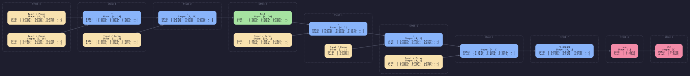
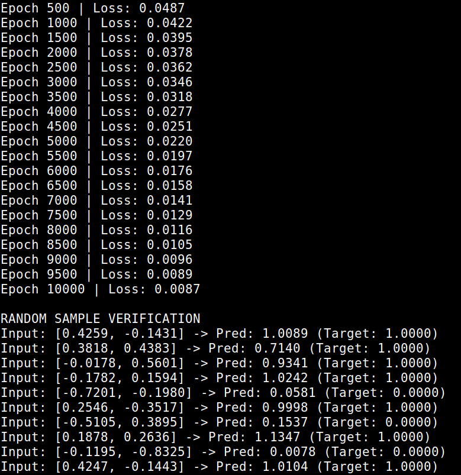

# TensorGrad

A neural network automatic differentiation framework built entirely from scratch in C++. Built to understand tensors, backpropogation, and memory optimization in deep learning frameworks.

Below is an actual snapshot of the engine's dynamic computational graph generating a forward and backward pass for a deep neural network, demonstrating the topological depth and exact gradient calculations.



## Core Features

- **Custom Tensor Core:** A multidimensional Tensor implementation supporting dynamic shapes, strides, and contiguous memory broadcasting, acting as the foundational data structure for all mathematical operations.
- **Dynamic Autograd Engine:** A reverse-mode automatic differentiation engine that builds a Directed Acyclic Graph (DAG) on the fly during the forward pass, calculating exact analytical gradients for backpropagation.
- **Two-Arena Memory Allocator:** Achieves `O(1)` memory allocation and completely eliminates runtime memory fragmentation.
  - **Parameter Arena:** Persistent storage for model weights and biases.
  - **Compute Arena:** Ephemeral, high-speed bump allocator for intermediate forward-pass tensors that resets instantly after every backward pass.
- **Topological Visualizer:** Natively exports the computational graph to Graphviz (`.dot`), rendering full-color, structural SVGs of the mathematical operations, data states, and gradient flows.
- **Zero Dependencies:** The core tensor math and memory engines rely purely on the C++ Standard Library.

## Project Structure

```text
TensorGrad/
├── include/               # Public API (Headers)
├── src/                   # Core Engine Implementation
└── examples/              # Executable proofs (XOR, Deep Networks)
```

## Prerequisites

- **C++17 Compiler:** GCC or Clang
- **CMake:** Version 3.10 or higher
- **Graphviz:** Required for rendering the topological network graphs.
  - Linux: `sudo apt install graphviz`
  - macOS: `brew install graphviz`

## Build Instructions

This project uses a standard out-of-source CMake build pipeline.

### Linux & macOS

```bash
# 1. Clone the repository
git clone [https://github.com/yourusername/autodiff_engine.git](https://github.com/yourusername/autodiff_engine.git)
cd autodiff_engine

# 2. Generate build files
mkdir build && cd build
cmake ..

# 3. Compile the static library and executables
make
```

<details>
<summary><b>Windows Build Instructions (Native MSVC)</b></summary>

**Prerequisites:** Visual Studio Build Tools (MSVC) and CMake Windows Installer.

Open the **x64 Native Tools Command Prompt** and run:

```cmd
:: 1. Clone the repository
git clone https://github.com/yourusername/autodiff_engine.git
cd autodiff_engine

:: 2. Generate MSVC solution files
mkdir build
cd build
cmake ..

:: 3. Compile the executable
cmake --build . --config Release

:: 4. Run the executable
Release\train_xor.exe
```

</details>

## Quick Start & Visualization

The repository includes executable examples that train models and automatically generate SVG visualizations of the deep architecture.

To run the XOR logic gate dataset and run the graph:

```bash
make run_xor
```

To run the Make Circles Dataset and generate the graph:

```bash
make run_circle
```

_Note: This will automatically execute the training loop, calculate the gradients, export `forward_pass.dot`, compile it to `graph.svg`, and open the visualizer._

### API Example

The public API is designed to be clean and intuitive, mirroring modern deep learning frameworks while remaining firmly in C++.

```cpp
#include "Tensor.hpp"
#include "Linear.hpp"
#include "Loss.hpp"
#include "Optimizer.hpp"

// 1. Define Architecture
Linear layer1(2, 16, "Hidden Layer 1");
Linear layer2(16, 1, "Output Layer");
MSELoss criterion;

// 2. Initialize Optimizer
std::vector<Tensor*> params;
auto l1p = layer1.parameters();
auto l2p = layer2.parameters();
params.insert(params.end(), l1p.begin(), l1p.end());
params.insert(params.end(), l2p.begin(), l2p.end());

SGD optimizer(params, 0.05);

// 3. Training Loop
for (int epoch = 0; epoch < 1000; epoch++) {
    // Forward Pass
    Tensor h1 = layer1(X);
    Tensor a1 = h1.relu();
    Tensor pred = layer2(a1);

    // Compute Loss
    Tensor loss = criterion(pred, Y);

    // Backward Pass (Autograd)
    optimizer.zeroGrad();
    loss.grad[0] = 1.0;
    loss.backward();

    // Update Weights & Clear Compute Memory
    optimizer.step();
    globalArena.reset();
}
```

### Example Output

Output for the make_circles dataset (`make run_circle`)


## Mathematical & Algorithmic Foundations

**1. Reverse-Mode Automatic Differentiation**
The framework does not use numerical approximation. It computes exact analytical gradients by dynamically traversing the Directed Acyclic Graph (DAG) and applying the chain rule. For a sequence of operations where a loss $L$ depends on $y$, and $y$ depends on a weight matrix $W$, the engine propagates the gradient backward via matrix calculus:

$$\frac{\partial L}{\partial W} = \frac{\partial L}{\partial y} \cdot \frac{\partial y}{\partial W}$$

**2. Objective Function Derivatives**
The `MSELoss` node seeds the root gradient for the backward pass. For a batch size $n$, target $Y$, and prediction $\hat{Y}$, the loss and its localized derivative are formulated as:

$$L = \frac{1}{n} \sum_{i=1}^{n} (\hat{Y}_i - Y_i)^2$$

$$\frac{\partial L}{\partial \hat{Y}_i} = \frac{2}{n} (\hat{Y}_i - Y_i)$$

**3. Deterministic Allocator Complexity**
By utilizing a contiguous, byte-aligned memory arena, the framework bypasses the heap fragmentation and search overhead associated with standard OS allocations. The Bump Allocator advances a physical memory pointer, achieving $O(1)$ time complexity for all intermediate tensor allocations during the forward and backward passes.
